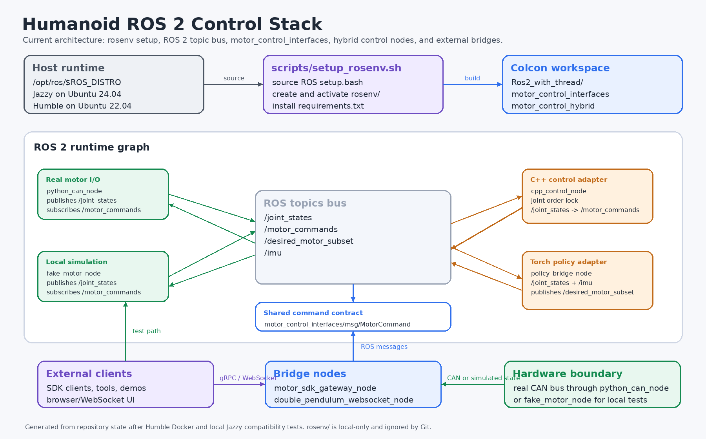

# Humanoid ROS 2 Control Stack

This repository contains the ROS 2 motor-control workspace and supporting runtime setup for the embedded humanoid stack.

The current architecture keeps ROS 2 as the runtime bus for motor state, motor commands, simulated hardware, policy output, and SDK/UI bridges. Python dependencies live in a local `rosenv/` virtual environment, which is ignored by Git and recreated from `scripts/setup_rosenv.sh`.

## Architecture



## Supported ROS 2 Environments

The code has been built and smoke-tested with:

- ROS 2 Jazzy on Ubuntu 24.04 / Python 3.12
- ROS 2 Humble on Ubuntu 22.04 / Python 3.10, tested in Docker with `fishros2/ros:humble-desktop-full`

Use the ROS distribution that matches the OS. Do not copy `rosenv/` between Ubuntu or ROS versions; recreate it locally.

## Repository Layout

```text
.
├── Ros2_with_thread/
│   ├── motor_control_interfaces/
│   │   └── msg/MotorCommand.msg
│   └── motor_control_hybrid/
│       ├── launch/hybrid_control.launch.py
│       ├── config/motors.yaml
│       ├── config/policy_bridge_config.json
│       ├── motor_control_hybrid/
│       │   ├── python_can_node.py
│       │   ├── fake_motor_node.py
│       │   ├── motor_sdk_gateway_node.py
│       │   ├── double_pendulum_websocket_node.py
│       │   └── policy_bridge_node.py
│       ├── src/cpp_control_node.cpp
│       └── requirements.txt
├── Interfaces/control_core/
├── scripts/setup_rosenv.sh
└── system.struct.png
```

## Runtime Model

### ROS Topics

- `/joint_states` (`sensor_msgs/JointState`): motor state from the real CAN node or fake motor node.
- `/motor_commands` (`motor_control_interfaces/MotorCommand`): final commands sent to the motor layer.
- `/desired_motor_subset` (`motor_control_interfaces/MotorCommand`): policy bridge output consumed by the C++ control node.
- `/imu` (`sensor_msgs/Imu`): optional policy input.

### Core Nodes

- `python_can_node`: real motor CAN I/O. Publishes `/joint_states` and consumes `/motor_commands`.
- `fake_motor_node`: local simulation stand-in for CAN hardware. Useful for build and launch smoke tests.
- `cpp_control_node`: C++ scheduler/control adapter. Consumes joint state and desired commands, then publishes `/motor_commands`.
- `policy_bridge_node`: Torch policy adapter. Reads joint/IMU state and publishes a desired motor subset.
- `motor_sdk_gateway_node`: gRPC bridge for external SDK clients.
- `double_pendulum_websocket_node`: browser/WebSocket visualization and interaction bridge.

## Setup

From the repository root:

```bash
# Jazzy / Ubuntu 24.04
ROS_DISTRO=jazzy source scripts/setup_rosenv.sh

# Humble / Ubuntu 22.04
ROS_DISTRO=humble source scripts/setup_rosenv.sh
```

The setup script:

- sources `/opt/ros/$ROS_DISTRO/setup.bash`
- creates `rosenv/` if missing
- activates `rosenv/`
- installs `Ros2_with_thread/motor_control_hybrid/requirements.txt`
- writes `rosenv/.requirements.stamp` so unchanged requirements are not reinstalled every run

The requirements include both runtime packages and ROS Python build helpers needed when building from inside the venv:

```text
pyyaml
typeguard
empy==3.3.4
lark
catkin_pkg
```

`empy` is pinned to `3.3.4` for ROS 2 Humble `rosidl_adapter` compatibility. This pin also builds successfully on Jazzy.

## Build

```bash
cd Ros2_with_thread
colcon build --symlink-install
source install/setup.bash
```

Both packages should appear after sourcing the workspace:

```bash
ros2 pkg list | grep -E 'motor_control_(hybrid|interfaces)'
```

Expected:

```text
motor_control_hybrid
motor_control_interfaces
```

## Launch

### Local Smoke Test Without CAN Hardware

```bash
ros2 launch motor_control_hybrid hybrid_control.launch.py \
  enable_fake_motor:=true \
  enable_sdk_gateway:=false \
  enable_websocket_ui:=false \
  enable_cpp_control:=true \
  enable_policy_bridge:=false
```

Expected startup messages include:

```text
Fake motor node started for joints: test_joint, test_joint2
CppControlNode started
Joint order locked from first /joint_states (2 joints).
```

### Real CAN Motor Control

```bash
ros2 launch motor_control_hybrid hybrid_control.launch.py \
  enable_fake_motor:=false \
  enable_cpp_control:=true \
  enable_sdk_gateway:=true
```

Configure real motors in:

```text
Ros2_with_thread/motor_control_hybrid/config/motors.yaml
```

### Policy Bridge

```bash
ros2 launch motor_control_hybrid hybrid_control.launch.py \
  enable_policy_bridge:=true \
  rl_model_path:=/path/to/policy.pt
```

Policy bridge configuration:

```text
Ros2_with_thread/motor_control_hybrid/config/policy_bridge_config.json
```

## Motor Command Contract

`motor_control_interfaces/msg/MotorCommand.msg`:

```text
std_msgs/Header header
string[] joint_name
uint8[] mode
float64[] position
float64[] velocity
float64[] acceleration
float64[] torque
float64[] kp
float64[] kd

uint8 MODE_VELOCITY=0
uint8 MODE_POSITION=1
uint8 MODE_MOTION=2
uint8 MODE_ENABLE=3
uint8 MODE_DISABLE=4
```

Index alignment rule:

- `joint_name[i]` aligns with `position[i]`, `velocity[i]`, `acceleration[i]`, `torque[i]`, `kp[i]`, and `kd[i]`.
- `mode` may be length `1` for broadcast or length `N` for per-joint mode selection.

## Command Examples

Velocity command:

```bash
ros2 topic pub -r 50 /motor_commands motor_control_interfaces/msg/MotorCommand \
"{joint_name:['shoulder_pitch','wrist_roll'], mode:[0], velocity:[0.5,-0.2]}"
```

Position command:

```bash
ros2 topic pub -1 /motor_commands motor_control_interfaces/msg/MotorCommand \
"{joint_name:['shoulder_pitch'], mode:[1], position:[0.0], velocity:[0.5], acceleration:[1.0]}"
```

Motion command:

```bash
ros2 topic pub -r 200 /motor_commands motor_control_interfaces/msg/MotorCommand \
"{joint_name:['elbow_pitch'], mode:[2], position:[0.3], velocity:[0.0], torque:[0.0], kp:[40.0], kd:[1.5]}"
```

Enable:

```bash
ros2 topic pub -1 /motor_commands motor_control_interfaces/msg/MotorCommand \
"{joint_name:['shoulder_pitch','elbow_pitch'], mode:[3]}"
```

Disable:

```bash
ros2 topic pub -1 /motor_commands motor_control_interfaces/msg/MotorCommand \
"{joint_name:['shoulder_pitch','elbow_pitch'], mode:[4]}"
```

## Docker Humble Notes

The local Humble test used `fishros2/ros:humble-desktop-full`. That image needed `python3.10-venv` installed before `scripts/setup_rosenv.sh` could create `rosenv/`.

If the image's ROS apt source has an expired key, disable that source for the temporary container and install `python3.10-venv` from Ubuntu Jammy repositories before testing.

## Git Policy for `rosenv/`

`rosenv/` is intentionally ignored and not committed. Recreate it with:

```bash
ROS_DISTRO=<humble|jazzy> source scripts/setup_rosenv.sh
```
