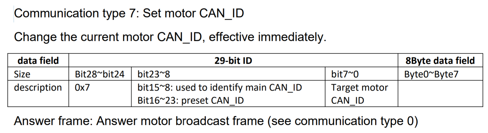
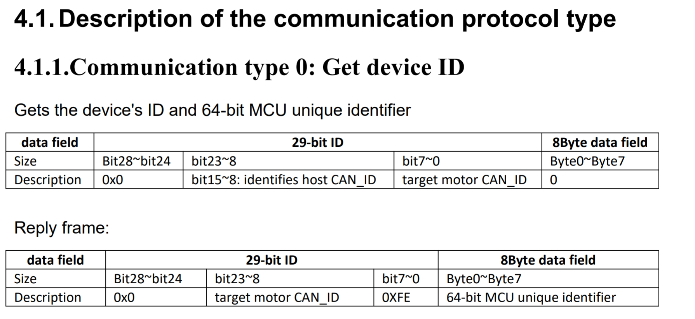

# Triton Droids — RobStride Leg Demo Setup (CAN + Python)

## Safety
- **Before running any script, be aware the legs may jump to the 0-position (dangerous).**
- Keep the robot stable, keep clear of pinch points, and have a quick way to cut power if needed.

---

## Motor CAN Commands (use with `cansend`)

### Setting motor CAN IDs
Command:
`cansend can0 0705FE7F#0000000000000000`

Breakdown:
- `07`: Command to remap CAN IDs
- `05`: The new CAN ID
- `FE`: Host ID (Not sure how important this is, can likely be anything)
- `7F`: Current motor CAN ID
- `#`: Denotes data
- `00 00 00 00 00 00 00 00`: 8 zero'd Data bytes

### Ping a motor
Command:
`cansend can0 0300FE01#0000000000000000`

Breakdown:
- `03`: Command to get motor status
- `00`: Empty
- `FE`: Host ID
- `01`: Motor ID to ping
- `#`: Denotes data
- `00 00 00 00 00 00 00 00`: 8 zero'd Data bytes

### Enter MIT Control Mode
Command:
`cansend can0 1900FE0A#0102030405060200`

Motor ID: `0A`

### Exit MIT Control Mode
Command:
`cansend can0 00A#FFFFFFFFFFFF00FD`

Motor ID: `0A`

### Start all 10 motors
Command:
`for i in {1..10}; do cansend can0 $(printf "0300FE%02X#0000000000000000" $i); sleep 0.05; done; echo "Motors Started"`

### Stop all 10 motors
Command:
`for i in {1..10}; do cansend can0 $(printf "0400FE%02X#0100000000000000" $i); sleep 0.05; done; echo "Motors Stopped"`

### Move motor to angle
Command:
`cansend can0 0184840A#8000802501000001`

### Scan for all motors in range
Command:
`for i in {0..12}; do cansend can0 $(printf "000001%02X#0000000000000000" $i); sleep 0.02; done; echo "Scanned for all motors"`

### Set Mechanical Zero for all motors in range
Command:
`for i in {1..10}; do cansend can0 $(printf "0600FE%02X#0100000000000000" $i); sleep 0.05; done; echo "Set mechanical zeros"`

### Monitor single motor continuously
Command:
`for i in {1..1000}; do cansend can0 0300FE0A#0000000000000000; sleep 0.5; done`

---

## Robot Leg Demo Setup

### 1) Hardware
- Plug in the Blue and Green USB-C to CAN Bus adapter.

### 2) Install CAN utilities
Command:
`sudo apt-get install can-utils`

### 3) Initialize CAN software
Run this once every time after boot, and sometimes when replugging the CAN module.

Commands:
`sudo modprobe slcan;`  
`sudo slcand -o -c -s6 /dev/ttyACM0 can0;`  
`sudo ip link set can0 down;`  
`sudo ip link set can0 type can bitrate 1000000;`  
`sudo ip link set can0 up;`

### 4) Monitor CAN traffic (separate terminal)
Command:
`candump -x -t a can0`

---

## RobStride Library (SDK) Setup

### 1) Get the SeeedStudio RobStride library
Commands:
`git clone https://github.com/Seeed-Projects/RobStride_Control.git`  
`cd RobStride_Control`  
`cd python`

### 2) Create and activate venv + install packages

> Recommended: create the venv inside `embedded/` (or a top-level workspace that encompasses your cloned repos).

From your workspace directory (this example uses `embedded/`):

`cd ~/Documents/embedded`
`python3 -m venv venv`
`source venv/bin/activate`

Install RobStride SDK Python deps (from the RobStride_Control requirements file):

`pip install -r ~/Documents/RobStride_Control/python/requirements.txt`

---

## Triton Droids Demo Script Setup

### 1) Download our tool to run the demo
Command:
`git clone -b robstride_control https://github.com/triton-droids/embedded.git`

### 2) Set mechanical zeros (required)
While powered off, place robot into a neutral pose flat on a table. Once all joints are in their 0-positions, run:

Command:
`for i in {1..10}; do cansend can0 $(printf "0600FE%02X#0100000000000000" $i); sleep 0.05; done; echo "Set mechanical zeros"`

If any motor loses power, you need to redo this process to reset the 0-point.

### 3) Optionally customize the demo script
Command:
`vim embedded/leg_swing_test.py`

Some useful configs are:
- `FREQ_HZ=0.8`
- `KP=10`
- `KD=0.2`
- `MAX_VEL_RAD_S=4.5`

### 4) Run the demo script
Command:
`python3 embedded/leg_swing_test.py`

---

## Additional Notes / Quick Fixes (Laptop Setup Differences)

### Install `git` if missing
Command:
`sudo apt install git`

### If `python3 -m venv` fails (missing venv support)
Command:
`sudo apt-get install python3-venv`

### Don’t try `pip install can-utils`
`can-utils` is installed via apt:
Command:
`sudo apt-get install can-utils`

### Fix for `No module named 'bus'` when running `embedded/*.py`
One simple approach that worked on the laptop was copying the SDK module directory into the `embedded` repo:

Command (example):
`cp -r robstride_dynamics ~/Documents/embedded/`

### Optional: interactive plotting / GUI backend support
Command:
`sudo apt-get install -y python3-pyqt5`

---

## Existing Repo Notes

Inversion array: [1, 1, 1, 1, 1, -1, -1, -1, -1, -1]

The inversion array should be interpreted sequentially for CAN ID's 1-10.

Joint limits:
RS04 - ID 1 - left_hip1_joint: [-1.57, 1.57]

RS03 - ID 2 - left_hip2_joint: [-1.57, 0.436332]

RS03 - ID 3 - left_thigh_joint: [-0.785398, 0.785398]

RS04 - ID 4 - left_knee_joint: [-2.0944, 0]

RS02 - ID 5 - left_ankle_joint: [-0.6, 0.6]

RS04 - ID 6 - right_hip1_joint: [-1.57, 1.57]

RS03 - ID 7 - right_hip2_joint: [-0.436332, 1.57]

RS03 - ID 8 - right_thigh_joint: [-0.785398, 0.785398]

RS04 - ID 9 - right_knee_joint: [-2.0944, 0]

RS02 - ID 10 - right_ankle_joint: [-0.6, 0.6]
