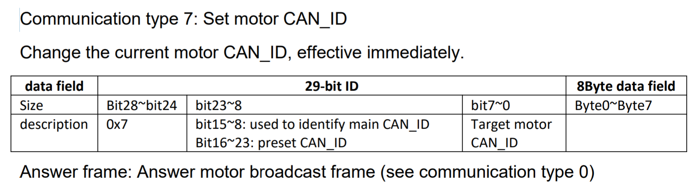
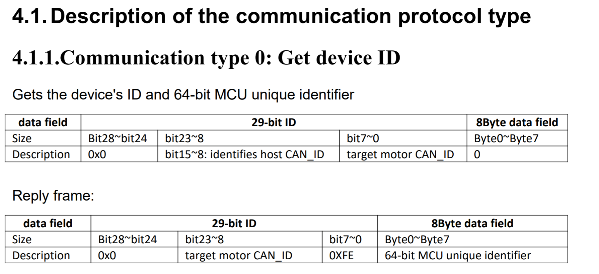

# Triton Droids: RobStride legs, direct-CAN stack

This branch (`robstride_data`) runs the 10-joint legs directly over CAN from Python: system-ID, policy deployment and bring-up tools. It's separate from `main`, which is the ROS 2 humanoid stack.

> **Joint names are mirrored.** Motors 1–5 (`left_*`) are the **physical right** leg, and 6–10 (`right_*`) the physical left leg.

## Safety

- **Robot supported** (gantry), with **someone holding the E-stop**, before anything enables motors.
- **Zeros:** before a session, check that the legs read about 0° when straight: `utils/validation_code/joint_direction_monitor.py --seconds 5`.
  - Run `zero_out.sh` only while every joint is held in the true straight pose. Running it at a bent pose stores that bend as "zero".
- **Battery:** the motors run from a battery. Pass `--vbus-min` (35 for 10S Li-ion, 36 for 12S LiFePO4) and charge it before high-load tests.
- **Never paste terminal output back into a terminal.** Lines containing `>` overwrite files, and a pasted command can move motors.

## Layout

```text
robot_hardware.py              joint map, motor models, signs, limits (single source)
robstride_dynamics/            RobStride CAN protocol (MIT frames, params, scaling tables)
ctrl_scripts/
  robot_interface.py           connect / enable / read / write / ankle linkage mapping
  run_tracking_policy.py       50 Hz ONNX motion-tracking runner (+ TorqueGuard, ImuSource)
  run_velocity_policy.py       velocity policy from a gamepad (deadman + A home, Start run, B stop)
  sysid_logger.py              timestamped hold / one-joint trials, fault bits, VBUS, manifest
  *_config.json, sysid_trials.json
utils/
  sysid_fit.py, sysid_report.py, plot_tracking_log.py   analysis
  motor_health_gui.py, gain_tuner.py                     bring-up and tuning (enable motors)
  imu_read.py, imu_read/imu_read.ino                     IMU reader and the IMU board firmware
  validation_code/             id_check, check_can_liveness, joint_direction_monitor,
                               motor_param_diff, motor_drag_test
docs/                          step-by-step guides (start with no_movement_motor_test_guide.md)
results/system_id/             fitted actuator parameters (raw logs stay in logs/, not in git)
```

## Setup

```bash
sudo apt-get install can-utils python3-venv
python3 -m venv .venv && .venv/bin/pip install -r requirements.txt
./setup.sh            # CANable -> can0 at 1 Mbit/s (slcand -s8), txqueuelen 1000
```

`setup.sh` has to run again after every boot or replug. To watch the bus: `candump -x -t a can0`.

## Workflow

1. **No movement:**
   - `python3 utils/validation_code/id_check.py --channel can0 --bitrate 1000000 --start 1 --end 10`
   - `./.venv/bin/python ctrl_scripts/sysid_logger.py --check` (never enables or transmits)
2. **Hold:** `./.venv/bin/python ctrl_scripts/sysid_logger.py --hold --seconds 10 --session logs/system_id/<name>`
3. **One-joint trials:** `sysid_logger.py --list`, then `--trial <name> --yes --session ...`. Summarise with `utils/sysid_report.py <session>`.
4. **Fit:** run `utils/sysid_fit.py <session> --base yaw` in the CPU venv. The result goes to `results/system_id/` and into training.
5. **Train** the velocity policy on the GPU machine (simulation repo, `cad/train_velocity.py`).
6. **Run it:** `./.venv/bin/python ctrl_scripts/run_velocity_policy.py --policy <run>/<run>.onnx --yes --vbus-min 35`. See `docs/velocity_policy_deployment.md`.

## Motor CAN commands (`cansend` reference)

Frame IDs are `TT DDDD II`: type, data, then motor ID. `FE` is the host ID.

| What | Command |
|---|---|
| Ping motor 1 | `cansend can0 0000FE01#0000000000000000` (type 0, get device ID) |
| Set CAN ID 0x7F → 0x05 | `cansend can0 0705FE7F#0000000000000000` |
| Stop / disable motor 1 | `cansend can0 0400FE01#0100000000000000` |
| Set zero, motor 1 | `cansend can0 0600FE01#0100000000000000` (hold the joint straight) |
| Scan IDs 0–12 | `for i in {0..12}; do cansend can0 $(printf "000001%02X#0000000000000000" $i); sleep 0.02; done` |

`0300FE..` (type 3) **enables** a motor. Use it only on purpose, with the robot supported.



